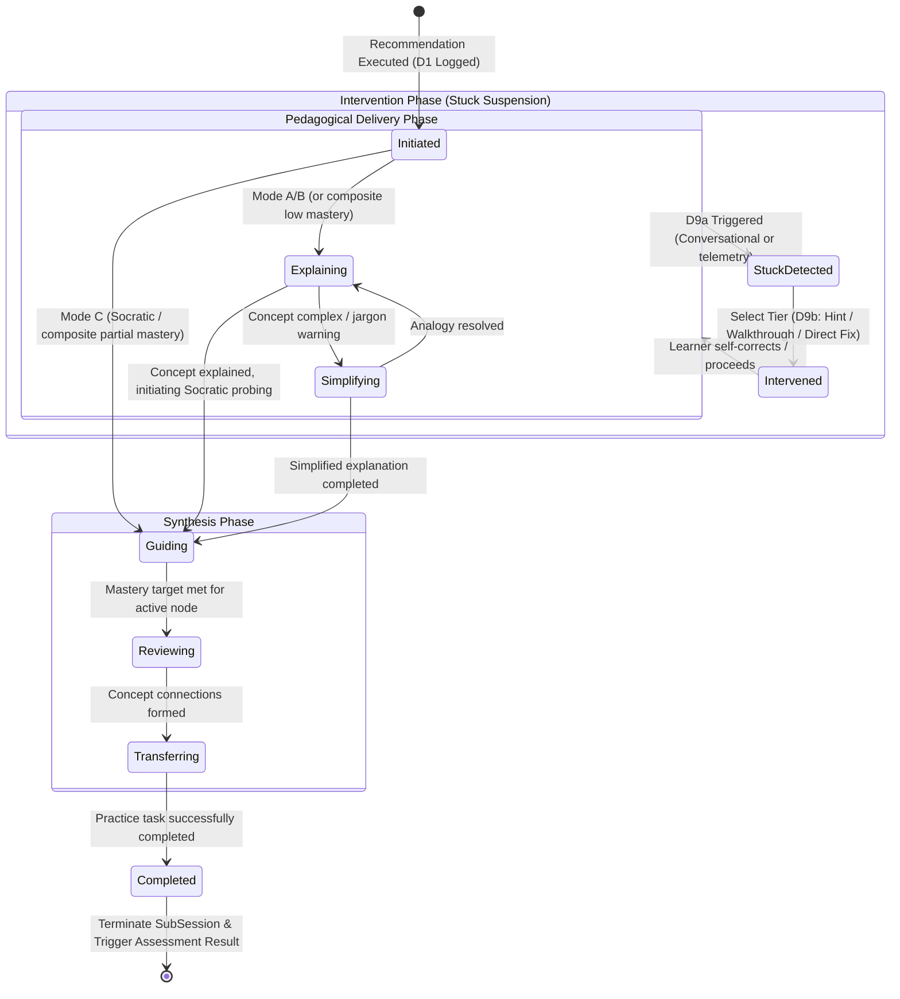

# Teaching Lifecycle Specification

This document details the runtime lifecycle of the **Teaching Engine** as it coordinates Socratic interactions and direct explanations within the active workspace hierarchy: `LearningSession` ➔ `SubSession` ➔ `MentorSession`.

---

## 1. Interaction Scope and Session Alignment

The Teaching Engine operates within the bounds of a single `SubSession` (focused on a specific `KnowledgeNode` or `RoadmapNode`) and orchestrates individual `MentorSession` turns (chat interactions).

```
LearningSession (Active Goal context)
  └── SubSession (Active KnowledgeNode focus, D1 Content Selection logged)
        └── MentorSession (Active chat turn, Socratic modes A/B/C/D active)
              ├── D1: Content Selection (Logged at initiation/node switch)
              ├── D9a: Stuck Detection (Monitored every turn)
              └── D9b: Intervention Tier Selection (Triggered on stuck detection)
```

---

## 2. State Transition Model

The teaching lifecycle represents the pedagogical phases of instruction for a single concept. It dynamically transitions based on:
1. The **Active Learning Mode** (A: Explain, B: Explain & Verify, C: Socratic, D: Mentor).
2. The **Mastery Level** projection (composite score based on Explain, Simplify, Guide, Review, Transfer).
3. **Evidence Event Triggers** (success or failure of learner responses).
4. **Stuck Detection Signals** (suspending the standard flow to apply interventions).



---

## 3. Detailed State Definitions

### 3.1 Initiated
- **Trigger:** Teaching Engine is invoked to execute an approved recommendation (e.g. `teach_node`).
- **Actions:** 
  - Retrieves context: Active `KnowledgeNode`, `LearningMode`, and `KnowledgeNodeMastery` history.
  - Logs **D1 Content Selection** decision header + detail.

### 3.2 Explaining / Simplifying (Explain & Simplify sub-capabilities)
- **Pedagogical Goal:** Direct delivery of concepts.
- **Explain State:** AI provides technical definitions, code syntax, and logic flow.
- **Simplify State:** AI breaks complex concepts into smaller fragments, introduces real-world analogies, or reduces mathematical notation.
- **Transition Criterion:** Moves to *Guiding* once basic knowledge acquisition is verified (or Mode C/D is requested).

### 3.3 Guiding (Guide sub-capability)
- **Pedagogical Goal:** Active Socratic guidance.
- **Actions:** AI presents code completion exercises, diagnostic prompts, or conceptual questions. It declines to provide direct answers, prompting the student to think through logical steps.
- **Transition Criterion:** Moves to *StuckDetected* if telemetry parameters indicate bế tắc (stuck state). Moves to *Reviewing* if the composite score of responses satisfies the mastery threshold.

### 3.4 StuckDetected & Intervened (D9a / D9b)
- **Pedagogical Goal:** Suspend standard Socratic restrictions to prevent learner frustration (violating Core Principle 6: "Do not let user be stuck for too long").
- **Actions:**
  - Standard Socratic questioning is suspended.
  - AI logs **D9a Stuck Detection** detailing the conversational loops or telemetry thresholds exceeded.
  - AI evaluates and logs **D9b Intervention Tier Selection** (selecting `hint`, `guided_walkthrough`, or `direct_fix` based on severity).
  - Delivers the selected tier intervention.
- **Transition Criterion:** Returns to *Delivery (Guiding)* as soon as the learner submits progress, self-corrects, or accepts the direct fix, returning to normal operation.

### 3.5 Reviewing (Review sub-capability)
- **Pedagogical Goal:** Conceptual synthesis.
- **Actions:** AI connects the active `KnowledgeNode` to previously mastered prerequisite nodes in the DAG. It prompts the learner to explain the relationships (e.g., "How does refresh token rotation extend what we did with access tokens?").

### 3.6 Transferring (Transfer sub-capability)
- **Pedagogical Goal:** Extrapolation and real-world application.
- **Actions:** AI challenges the learner to apply the concept directly to their active project/goal (e.g., "Add the token rotation service we designed to your Express API script").

### 3.7 Completed
- **Trigger:** Learner completes the transfer exercise successfully.
- **Actions:**
  - Submits final session `Evidence` to the Evidence Domain.
  - Triggers the Assessment Domain to evaluate and update `KnowledgeNodeMastery` and emit `AssessmentResult`.
  - Ends the current `SubSession`.
