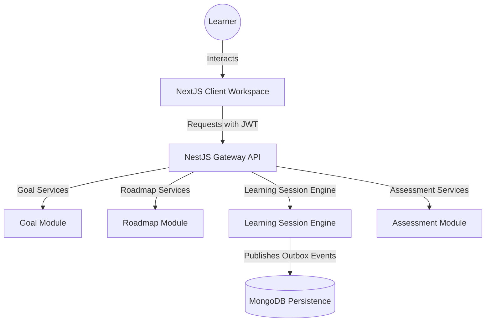

# Frontend Architecture

This document describes the design, routing mechanisms, and data synchronizations implemented in the **Memento OS** adaptive learning product workspace.

## System Topology

The frontend is a next-generation web client compiled using **Next.js 14 App Router** and **TypeScript 5.x**, connecting to the modular NestJS backend.

## Security & Session Architecture

1. **Tokens Persistence**:
   - Access token is kept strictly in memory inside the Zustand state store (`AuthStore`).
   - Refresh token is stored in `localStorage` to preserve login sessions across page updates.

2. **Auto-Rotation**:
   - Axios request interceptor injects the Bearer Access Token on every request.
   - Axios response interceptor catches `401 Unauthorized` responses, triggers a credentials refresh (`POST /auth/refresh`), updates the local store, and replays all failed requests in a queue.

## State Management

- **Client state**: Managed using `zustand` stores (`AuthStore` for session credentials, `ToastStore` for publishing notifications).
- **Server Cache**: Managed using `@tanstack/react-query` to handle cache validation, optimistic updates, and background page synchronization.
