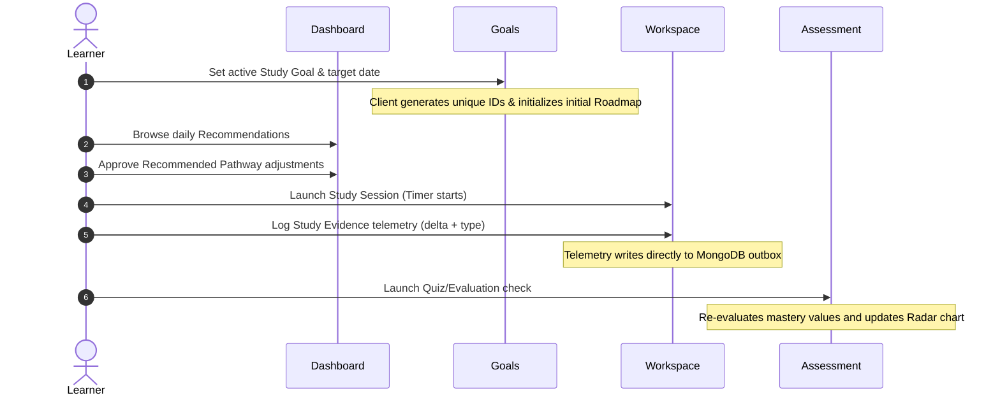

# User Journey & Adaptive Loop Validation

This document tracks how a learner completes the adaptive loop inside **Memento OS**.

## Closed-Loop Execution Pathway

## Step-by-Step Experience Guide

1. **Setting the Target**:
   - The learner defines a goal (e.g., "Outbox Pattern Hardening").
   - The client immediately provisions a roadmap outline containing milestones and task checklists.

2. **Studying & Logging Evidence**:
   - The learner launches the workspace session. A countdown timer keeps them focused.
   - When a practice milestone is hit, the learner presses "Log Study Evidence" to send a verified telemetry signal (e.g., +3 confidence points on concurrency locks).

3. **Verifying Readiness**:
   - The learner opens the Assessment Center and completes a competency verification check.
   - Their profile is updated, knowledge gaps are resolved, and the updated confidence radar chart provides immediate visual feedback.
