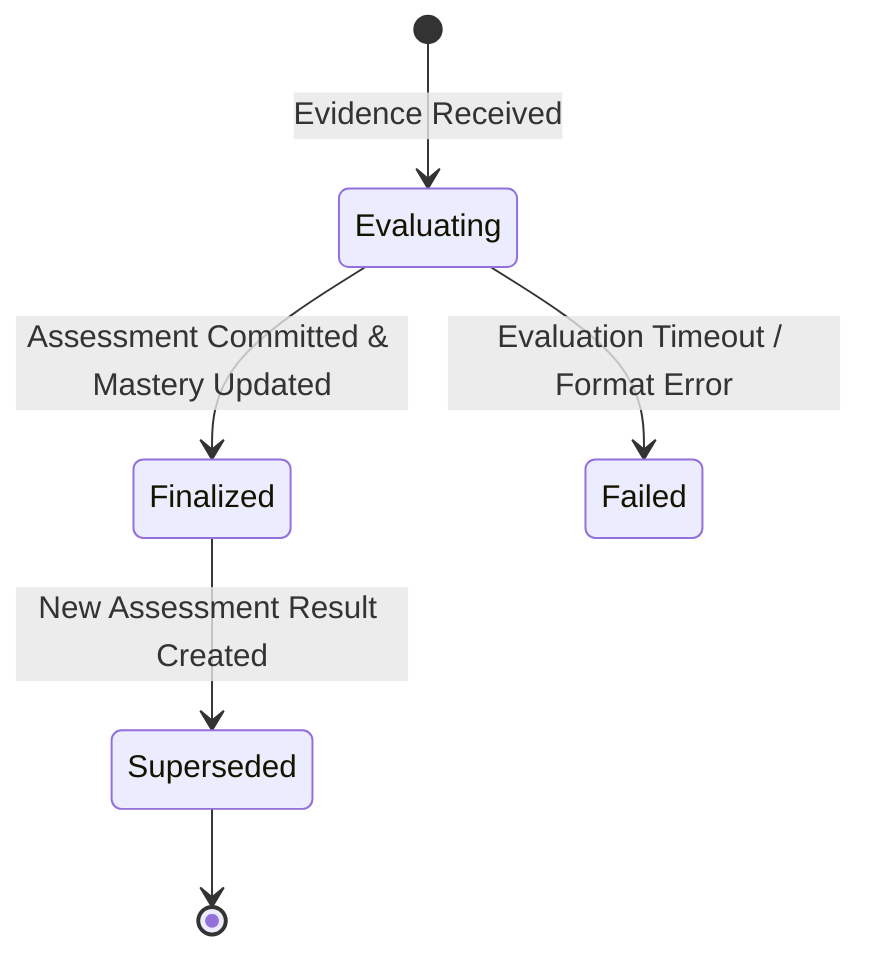
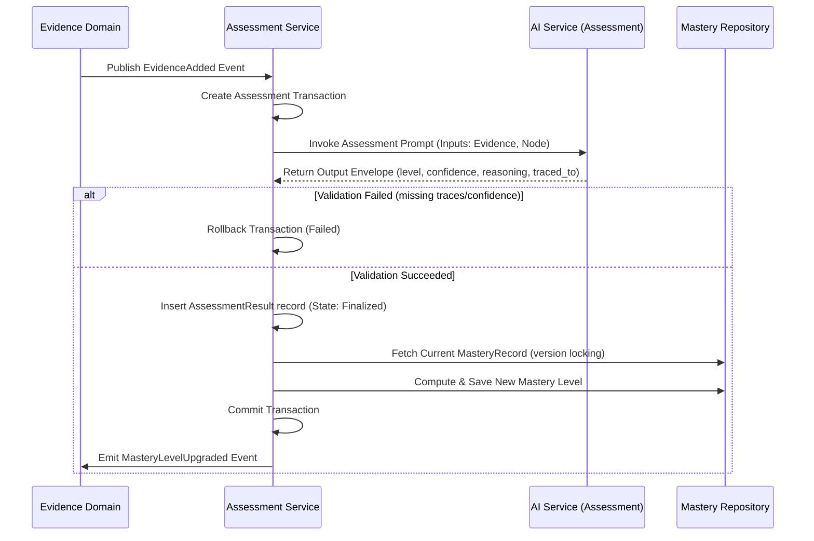

# Assessment Lifecycle

- **Status:** Approved Design Document
- **Domain Scope:** Assessment Domain & Engine
- **Traceability:** DECISION-026 (Write-ownership of mastery), DECISION-030 (AssessmentResult structure)

---

## 1. `AssessmentResult` State Lifecycle

An individual `AssessmentResult` is immutable and append-only, transitioning through three operational states:

### 1.1 State Definitions
* **`Evaluating`:** The system is parsing evidence inputs and invoking the prompt evaluation templates.
* **`Finalized`:** The result has been saved successfully, mastery has been upgraded, and domain events have been emitted.
* **`Failed`:** The prompt evaluation failed to return valid confidence or trace references, resulting in transaction rollback.
* **`Superseded`:** A newer `AssessmentResult` has been created for the same learner-node pair. The historical record is preserved for progress tracking.

---

## 2. Step-by-Step Assessment Pipeline

Evaluations are triggered by new evidence events:

---

## 3. Lifecycle Rules & Triggers
* **Atomicity Check:** The `AssessmentResult` and `mastery_record` updates are executed in a single transaction. If any step fails (including optimistic concurrency version conflicts), the entire operation rolls back.
* **Superseding Rule:** A new `Finalized` assessment result does not delete the old results; it simply marks them as historical (status = `Superseded` logically), assuring audit traceability.
