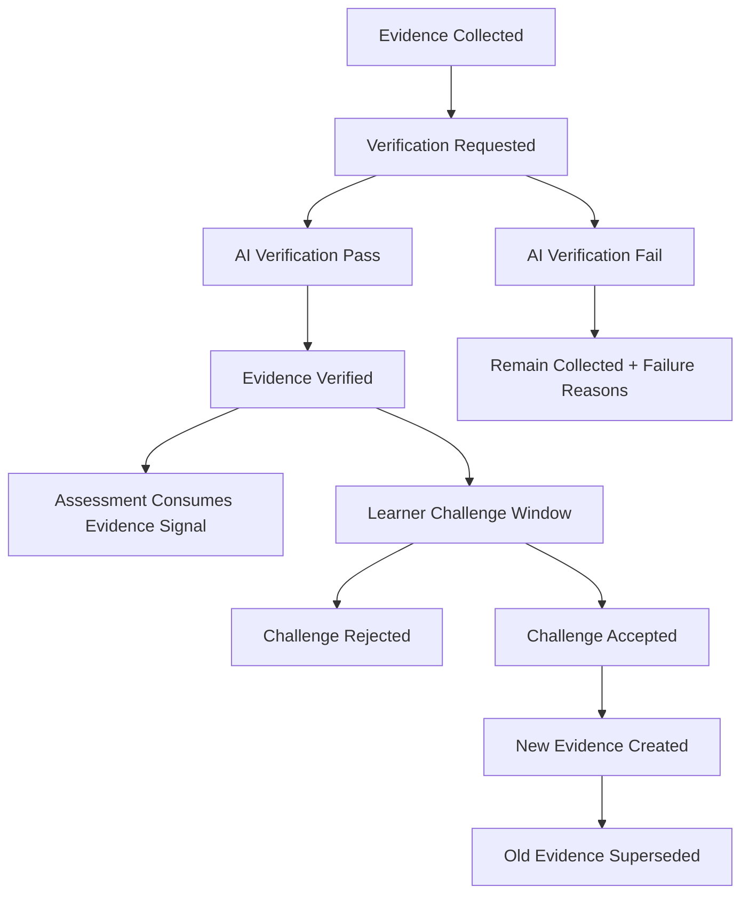

# Evidence Verification Model

- **Status:** Draft Design Document (Evidence Domain Design Sprint)
- **Domain Scope:** Evidence Domain (with Assessment-integrated authority boundaries)
- **Traceability:** DECISION-026, DECISION-048, DECISION-053

---

## 1. Verification Workflow Overview

Verification confirms whether collected evidence is trustworthy, explainable, and eligible for downstream assessment consumption.

---

## 2. Verification Stages

1. **Intake Validation**
   - required fields present
   - source references resolvable

2. **Normalization Validation**
   - payload conforms to evidence type schema

3. **AI Verification**
   - estimate confidence
   - generate reasoning
   - generate/validate traced_to links
   - compute evidence weight

4. **Policy Validation**
   - lifecycle guardrails
   - ownership restrictions (no mastery writes)
   - explainability minimums

5. **Outcome Commit**
   - pass -> `Verified`
   - fail -> remains `Collected` with diagnostics

---

## 3. AI Verification Requirements

AI verification output must include:
- `is_verifiable` (bool)
- `confidence` (0..1)
- `reasoning` (string)
- `traced_to[]` (array)
- `computed_source_weight`
- `computed_evidence_weight`

Rejection conditions:
- low confidence with unresolved ambiguity
- missing traceability
- contradictory artifacts
- malformed payload

---

## 4. Learner Challenge Flow

Learner may challenge a verified evidence record.

### 4.1 Challenge Inputs
- challenged evidence id
- challenge reason category
- optional supporting artifact references

### 4.2 Challenge Outcomes
1. **Rejected challenge**
   - evidence remains `Verified`
   - challenge resolution reasoning logged
2. **Accepted challenge**
   - correction/new evidence created
   - old evidence transitions to `Superseded`
   - explicit supersede link old -> new

### 4.3 Invariants
- challenge resolution must be explainable (`confidence`, `reasoning`, `traced_to[]`)
- historical evidence remains immutable; correction is append + supersede

---

## 5. Superseding Evidence Rules

Superseding applies to `Verified` records only.

Mandatory conditions:
1. new evidence must itself pass verification
2. supersede reason must be explicit
3. bidirectional referential integrity must be enforceable for audit traversal
4. superseded evidence cannot be re-verified

---

## 6. Verification Events

- `EvidenceVerificationRequested`
- `EvidenceVerificationCompleted`
- `EvidenceVerificationFailed`
- `EvidenceChallengedByLearner`
- `EvidenceChallengeResolved`
- `EvidenceSuperseded`

These events are consumable by Assessment and Recommendation pipelines as signals, not as direct write authority transfer.

---

## 7. Boundary Compliance

Verification flow must enforce:
- Evidence Domain can verify evidence quality and state
- Assessment Domain alone decides mastery/regression actions from verified evidence
- No recommendation creation from Evidence verifier
- No roadmap modification from Evidence verifier

---

## 8. Audit Requirements

Every verification attempt stores:
- verifier actor type/id (AI service or human reviewer)
- timestamp
- decision outcome
- confidence
- reasoning
- traced_to references
- policy checks passed/failed
