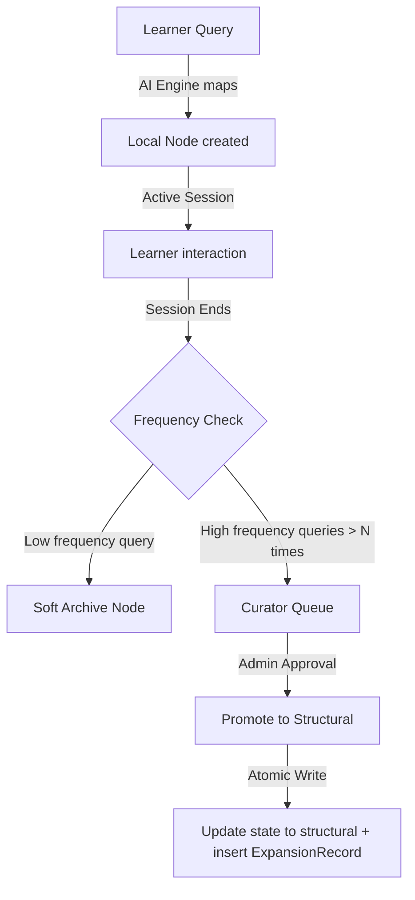

# Knowledge Graph Expansion Mechanism

- **Status:** Approved Design Document
- **Domain Scope:** Knowledge Domain & Engine
- **Traceability:** DECISION-023 (Controlled Expansion), DECISION-027 (Explainability First, traced_to[])

---

## 1. Expansion Classifications

To prevent curriculum bloat while allowing personalized, deep learning queries, the system classifies expansions into two categories:

### 1.1 Local Expansion (D5, Silent)
* **Trigger:** A learner asks a highly specific, niche question during chat interaction or discovery that is not mapped in the public graph.
* **Scope:** Visible **only** to the requesting learner's active session.
* **Database Representation:** Creates a `KnowledgeNode` in state `local`.
* **Traceability:** Linked internally via the `TraceLink` table to the triggering `discovery_answer` or `evidence` entity. No public `ExpansionRecord` is exposed to other users.

### 1.2 Deep-Structural Expansion (D4, Canonical)
* **Trigger:** An admin promotes a local expansion, or the AI service identifies a global prerequisite gap shared across multiple learners.
* **Scope:** Visible **globally** to all learners.
* **Database Representation:** Creates/Updates a `KnowledgeNode` in state `structural`.
* **Traceability:** Must write an `ExpansionRecord` containing the reasoning behind the structural change, and an array of `traced_to` identifiers.

---

## 2. Dynamic Promotion & Curation Workflow

Local nodes are audited and promoted to canonical structural nodes through a curation funnel:

### 2.1 Promotion Requirements
- A database transaction must atomically transition `knowledge_node.status` from `local` to `structural` and insert an associated `ExpansionRecord`.
- The `ExpansionRecord` reasoning must clearly justify the curriculum addition (e.g. `"JWT signature checking represents a core security skill required for all NodeJS REST API goal implementations"`).
- The `traced_to` references must link to the historic user answers or session IDs that prompted the expansion.
- Run-time cycle detection must execute successfully during the promotion step.
