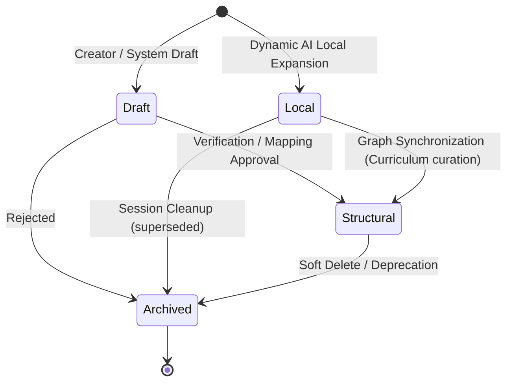
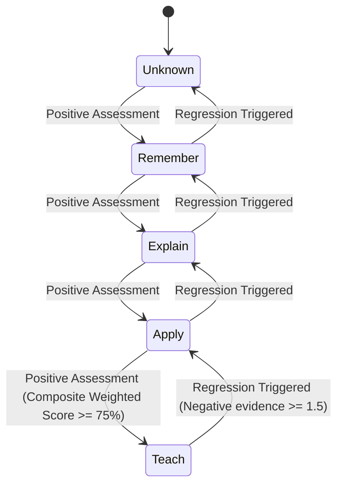

# Knowledge & Mastery Lifecycle

- **Status:** Approved Design Document
- **Domain Scope:** Knowledge Domain & Engine
- **Traceability:** DECISION-023 (Controlled Expansion), DECISION-017 (Mastery levels), DECISION-026 (Assessment owners)

---

## 1. `KnowledgeNode` State Lifecycle

A canonical node in the global graph transitions through several operational states:

### 1.1 State Definitions
* **`Draft`:** Created by curriculum writers or auto-generated by systems but not yet published. Hidden from learners.
* **`Local` (D5 Expansion):** Added dynamically by the AI Mentor to resolve a specific user's detailed query (D5 Local Expansion). Only visible to the triggering learner's active session.
* **`Structural` (D4 Expansion):** Merged into the public, global curriculum map. Visible to all learners.
* **`Archived`:** Soft-deleted. Visible to historic reporting layers, hidden from active roadmaps.

### 1.2 Transition Rules

| Source State | Allowed Next State | Trigger | Validation / Action |
| :--- | :--- | :--- | :--- |
| `Draft` | `Structural` | Curriculum Admin Approval | Graph cycle check executed. |
| `Draft` | `Archived` | Rejection | Soft-deleted. |
| `Local` | `Structural` | Curriculum Syncer promotion | Graph-wide review. Generates a permanent `ExpansionRecord`. |
| `Local` | `Archived` | Session ends without promotion | Cleaned up. |
| `Structural` | `Archived` | Node deprecation | Removed from search index. Historic Mastery records preserved (Right to be Forgotten via anonymization, DECISION-037). |

---

## 2. `KnowledgeNodeMastery` State Lifecycle

Learner mastery is evidence-driven and represents assessed levels of competence.

### 2.1 State Definitions (Bloom's Taxonomy Levels)
* **`Unknown`:** Learner has no recorded evidence of interacting with this concept.
* **`Remember`:** Learner can define terms, recall facts, and locate information.
* **`Explain`:** Learner can classify, describe, discuss, and summarize concepts.
* **`Apply`:** Learner can execute tasks, implement algorithms, and solve practical scenarios.
* **`Teach`:** Learner can evaluate solutions, debug code, review peer implementations, and transfer knowledge. Evaluated via composite scores (DECISION-020).

### 2.2 Transition & Assessment Engine Rules
- **No Time-Based Decay (DECISION-016):** Mastery levels never decrease simply due to the passage of time.
- **Evidence-Driven Regression (DECISION-021/053):** Mastery regresses to a lower state only when cumulative negative evidence weights (e.g. failing tests, incorrect probe explanations) exceed the threshold of $\ge 1.5$.
- **Write Ownership:** Only the Assessment Domain can update `KnowledgeNodeMastery` rows. Other services read these values to adjust roadmap proposals.
