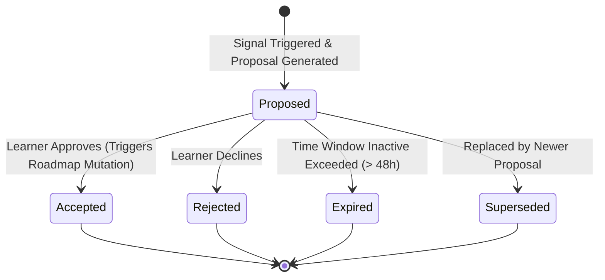

# Recommendation Lifecycle

- **Status:** Approved Design Document
- **Domain Scope:** Recommendation Domain & Engine
- **Traceability:** DECISION-019 (Proposal-only), DECISION-033 (Adaptive Pause confirmation)

---

## 1. `RecommendationProposal` State Lifecycle

Every proposal created transitions through the following lifecycle states:

### 1.1 State Definitions
* **`Proposed`:** The recommendation is generated and displayed on the learner's dashboard.
* **`Accepted`:** The learner accepts the proposal. The system routes the request to the Roadmap or Learning Session domains to apply the modifications.
* **`Rejected`:** The learner rejects the proposal. The proposal is archived, and the system suspends re-evaluating this specific recommendation for 24 hours.
* **`Expired`:** The proposal was not acted upon and is no longer valid.
* **`Superseded`:** A new curriculum or regression event has generated a more urgent recommendation, overriding this proposal.

### 1.2 Transition & Timeout Rules

| Source State | Allowed Next State | Trigger | Validation / Action |
| :--- | :--- | :--- | :--- |
| `Proposed` | `Accepted` | Learner triggers Accept API | Invokes Roadmap Domain to update nodes / parameters. |
| `Proposed` | `Rejected` | Learner triggers Reject API | Logs rejection; updates dashboard. |
| `Proposed` | `Expired` | Inactivity Timeout | Auto-expires after 48 hours. |
| `Proposed` | `Superseded` | New priority proposal generated | Triggered when a new mismatch/regression affects the same node. |
