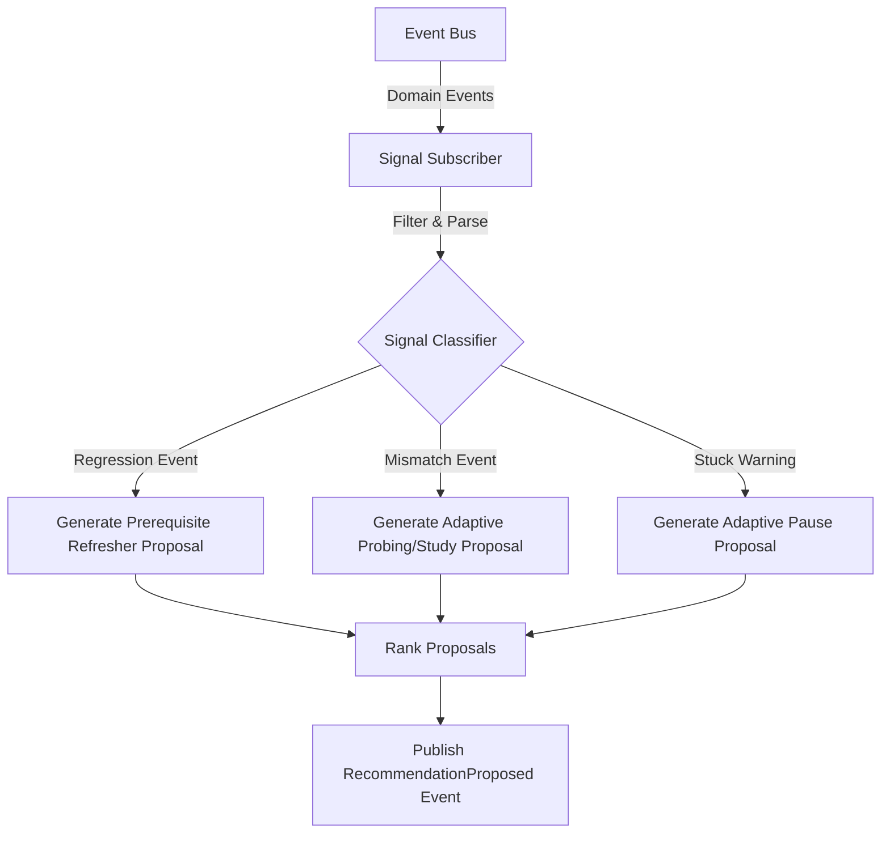

# Recommendation Signal Model

- **Status:** Approved Design Document
- **Domain Scope:** Recommendation Domain & Engine
- **Traceability:** DECISION-019 (Independent capability), DECISION-051 (Mismatch), DECISION-053 (Regression)

---

## 1. Input Signals & Triggers Matrix

The Recommendation Engine monitors events from other core domains and maps them to specific recommendation triggers:

| Input Domain | Trigger Event / Signal | Trigger Condition | Output Recommendation Type |
| :--- | :--- | :--- | :--- |
| **Assessment** | `KnowledgeRegressionDetected` | Level demoted by 1. | **`insert_node`** (Refresher node). Proposes re-introducing the regressed prerequisite node into the active path. |
| **Assessment** | `SelfAssessmentMismatchDetected` | observed < self-reported level. | **`insert_node`** (Calibrated probe node) or **`change_mode`** (adjust to structured study mode). |
| **Discovery** | `DiscoverySessionCompleted` | New claims mapped to Knowledge Graph. | **`insert_node`** (Path construction). Proposes inserting newly identified prerequisite nodes into the roadmap. |
| **Learning Session** | Stuck detection warning (D9a) | Learner inactive / failing labs $\ge 3$ times. | **`pause_session`** (Adaptive Pause proposal, DECISION-033) or **`change_mode`** (Switching to a supportive ladder mode). |
| **Knowledge Graph** | Canonical update event | Dynamic structural node expansion (D4). | **`insert_node`** (Path enhancement). Proposes updating existing roadmaps with the new canonical node. |

---

## 2. Dynamic Recommendation Pipeline

