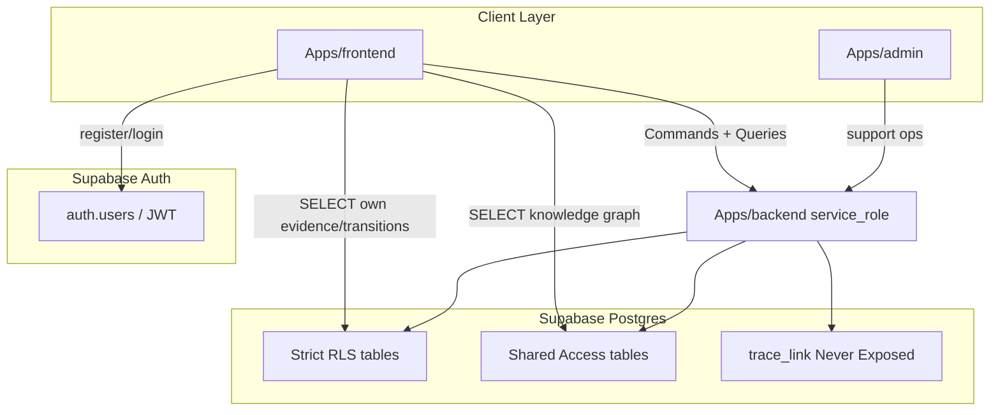

# Access Path Analysis — Supabase Policy Preparation

> **Round:** Supabase Policy Preparation Review.  
> **Scope:** All 17 tables from DDL Round 1–3.  
> **No SQL. Architecture review only.**  
> **Sources:** [FRONTEND_BACKEND_INTERACTION_REVIEW.md](../07_API/FRONTEND_BACKEND_INTERACTION_REVIEW.md), [SUPABASE_AUTH_ALIGNMENT.md](SUPABASE_AUTH_ALIGNMENT.md), [COMMAND_QUERY_ARCHITECTURE.md](../07_API/COMMAND_QUERY_ARCHITECTURE.md), [RLS_ACTOR_MODEL.md](RLS_ACTOR_MODEL.md).

---

## 0. Access Path Definitions

| Path | Description |
|---|---|
| **Direct Frontend** | `Apps/frontend` → Supabase PostgREST with Learner JWT (`authenticated` role); RLS enforces row scope |
| **Frontend → Backend** | `Apps/frontend` → `Apps/backend` API → Supabase with `service_role` (RLS bypass); Backend enforces Module authorization |
| **Admin → Backend** | `Apps/admin` → `Apps/backend` with Admin authorization layer (not Supabase RLS) |
| **Service Only** | `Apps/backend` internal Application Service → Supabase `service_role`; no client credential |
| **System Only** | Postgres triggers / migrations / DB engine; no application actor |

---

## 1. Per-Table Access Path Matrix

| # | Table | Safe path | Unsafe path | Recommended path |
|---|---|---|---|---|
| 1 | `learner` | Frontend → Backend (Query) | Direct Frontend SELECT/UPDATE | **Frontend → Backend** for profile; RLS defense-in-depth if direct read added later |
| 2 | `goal` | Frontend → Backend | Direct Frontend INSERT/UPDATE | **Frontend → Backend** |
| 3 | `roadmap` | Frontend → Backend | Direct Frontend write | **Frontend → Backend** |
| 4 | `roadmap_node` | Frontend → Backend | Direct Frontend write/reorder | **Frontend → Backend** |
| 5 | `approval_record` | Frontend → Backend (approve Command) | Direct Frontend INSERT | **Frontend → Backend** |
| 6 | `learning_session` | Frontend → Backend | Direct Frontend state mutation | **Frontend → Backend** |
| 7 | `sub_session` | Frontend → Backend | Direct Frontend write | **Frontend → Backend** |
| 8 | `learning_session_transition` | Direct Frontend SELECT (own rows) | Direct Frontend INSERT/UPDATE | **Direct Frontend** read; **Service Only** write |
| 9 | `knowledge_node` | Direct Frontend SELECT; Service write | Direct Frontend INSERT/UPDATE | **Direct Frontend** read; **Service Only** write |
| 10 | `knowledge_edge` | Direct Frontend SELECT; Service write | Direct Frontend write | **Direct Frontend** read; **Service Only** write |
| 11 | `knowledge_node_mastery` | Frontend → Backend | Direct Frontend UPDATE | **Frontend → Backend** |
| 12 | `evidence` | Direct Frontend SELECT (own rows) | Direct Frontend INSERT (bypass validation) | **Direct Frontend** read; **Frontend → Backend** for submit (Command) |
| 13 | `evidence_link` | Direct Frontend SELECT (own rows) | Direct Frontend write | **Direct Frontend** read; **Service Only** write |
| 14 | `assessment_result` | Frontend → Backend | Direct Frontend write | **Frontend → Backend** |
| 15 | `trace_link` | Service Only (ExplainabilityService) | Direct Frontend any; Admin raw query | **Service Only** |
| 16 | `roadmap_node_knowledge_node` | Frontend → Backend | Direct Frontend write | **Frontend → Backend** |
| 17 | `expansion_record` | Direct Frontend SELECT; Service write | Direct Frontend write | **Direct Frontend** read; **Service Only** write |

---

## 2. Access Path by Category

### 2.1 Direct Frontend (read exceptions only)

Confirmed by API Architecture Round — **exactly 3 read surfaces**, zero direct writes:

| Table | Operation | RLS requirement |
|---|---|---|
| `evidence` | SELECT own rows | Strict: `learner_id = auth.uid()` |
| `evidence_link` | SELECT own rows | Strict: via `evidence.learner_id` |
| `learning_session_transition` | SELECT own rows | Strict: via `learning_session.learner_id` |

**Plus Shared read (all authenticated):**

| Table | Operation |
|---|---|
| `knowledge_node` | SELECT all |
| `knowledge_edge` | SELECT all |
| `expansion_record` | SELECT all |

**Auth (not a Backend table):** Supabase Auth SDK — register/login/refresh — no RLS on `auth.users` from Backend.

### 2.2 Frontend → Backend (default for Learner-owned)

All Commands; all aggregated Queries/Projections; all writes; most Learner-owned reads:

`goal`, `roadmap`, `roadmap_node`, `approval_record`, `learning_session`, `sub_session`, `knowledge_node_mastery`, `assessment_result`, `roadmap_node_knowledge_node`, `learner` (profile/anonymization)

Backend verifies JWT → extracts `learner_id` → Application Service → `service_role` insert/update.

**Why recommended over Direct Frontend read:** Business validation (DECISION-019, DECISION-032, orchestration rules) lives in Application Services; RLS alone cannot enforce "only one active Goal" or "no self-requested Recommendation."

### 2.3 Admin → Backend

| Capability | Path | Notes |
|---|---|---|
| Cross-Learner read (support/debug) | Admin → Backend → service_role | **Scope not yet decided** — requires separate Decision |
| Cross-Learner write | **Blocked** unless future Decision | Admin must not mutate Learner business state |
| Shared Knowledge read | Admin → Backend OR Direct (same as Learner) | No Learner-specific data |
| `trace_link` / Decision Header | Admin → Backend Read Model only | Never raw table |

Admin has **no separate Supabase Postgres role** — authorization is Backend code-level ([RLS_ACTOR_MODEL.md](RLS_ACTOR_MODEL.md) mục 1.2).

### 2.4 Service Only

| Table / operation | Service | Caller |
|---|---|---|
| All writes (every table) | Respective Application Service | Frontend Command → Backend |
| `trace_link` (all operations) | ExplainabilityService | Assessment, Recommendation, Knowledge Graph, Discovery Modules |
| `evidence_link` INSERT | EvidenceCaptureService | Mentor Interaction flow |
| `knowledge_node`/`knowledge_edge`/`expansion_record` INSERT | KnowledgeExpansionService | Event-driven expansion |
| `assessment_result` INSERT | AssessmentService | EvidenceRecorded consumer |
| `learning_session_transition` INSERT | LearningSessionOrchestrationService | State transition |

### 2.5 System Only

| Mechanism | Tables | Path |
|---|---|---|
| History triggers ([DECISION-045](../11_Decisions/DECISION-045-Temporal-Strategy.md)) | `history.learner`, `history.knowledge_node` (when created) | Trigger function on UPDATE |
| `version_number` increment | `learner`, `knowledge_node_mastery` | BEFORE UPDATE trigger |
| Migrations / seed | All | CI/CD pipeline, not runtime actors |

---

## 3. Tables That Must Never Be Queried Directly by Frontend

| Table | Reason | How Frontend gets data |
|---|---|---|
| **`trace_link`** | Never Exposed; polymorphic; explainability integrity | Assessment/Recommendation/Expansion Read Models JOIN at Backend |
| **`assessment_result`** *(recommended)* | Sensitive AI reasoning; explainability chain | `GetAssessmentResults` Query |
| **`knowledge_node_mastery`** *(recommended)* | Concurrent write surface; Assessment write-owner | `GetCurrentMastery` Query |
| **`goal`/`roadmap`/`roadmap_node`** *(recommended)* | Governance/orchestration rules | Roadmap Queries |
| **`learning_session`/`sub_session`** *(recommended)* | Orchestrator state machine | Session Queries |
| **`roadmap_node_knowledge_node`** *(recommended)* | D6 decision trace not in table | Roadmap Query with dependencies |
| **`learner`** *(recommended)* | Anonymization workflow | `GetLearnerProfile` Query |

**Hard ban (architecture):** only `trace_link`.

**Soft ban (recommended path, RLS would allow SELECT):** remaining rows above — defense-in-depth plus business logic in Backend.

**Allowed Direct Frontend SELECT:** `evidence`, `evidence_link`, `learning_session_transition`, `knowledge_node`, `knowledge_edge`, `expansion_record`.

---

## 4. Cloud AI Access Path

| Path | Allowed? |
|---|---|
| Cloud AI → Supabase | **Never** |
| Cloud AI → Backend → Supabase | **Never** (Cloud AI does not hold credentials) |
| Backend reads DB → sends payload → Cloud AI → returns output → Backend writes | **Only valid path** |

---

## 5. Access Path Flow (summary)

---

## Liên kết ngược

[TABLE_SECURITY_CLASSIFICATION.md](TABLE_SECURITY_CLASSIFICATION.md), [POLICY_COMPLEXITY_MATRIX.md](POLICY_COMPLEXITY_MATRIX.md), [RLS_RISK_REVIEW.md](RLS_RISK_REVIEW.md), [POLICY_AUTHORING_PREPARATION.md](POLICY_AUTHORING_PREPARATION.md).
