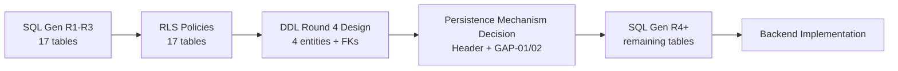

# DDL Finalization Readiness — AI Mentor OS

> **Round:** DDL Finalization Review.  
> **Scope:** Readiness for SQL generation, policy authoring, backend, production. Answers all 15 mandatory questions.  
> **No SQL. Review only.**

---

## 1. If SQL Generation Started Tomorrow

### 1.1 Can be generated safely

| Batch | Tables / objects | Confidence | Source verdict |
|---|---|---|---|
| **Round 1** | `learner`, `goal`, `roadmap`, `roadmap_node`, `approval_record`, `learning_session`, `sub_session`, `learning_session_transition` | **High** | [DDL_ROUND1_REVIEW.md](DDL_ROUND1_REVIEW.md) — READY_FOR_SQL_GENERATION |
| **Round 2** | `knowledge_node`, `knowledge_edge`, `knowledge_node_mastery`, `evidence`, `evidence_link`, `assessment_result`, `trace_link` | **High** | ROUND2 reviews |
| **Round 3** | `roadmap_node_knowledge_node`, `expansion_record` | **High** | [DDL_ROUND3_REVIEW.md](DDL_ROUND3_REVIEW.md) |
| **Patch FK** | `ALTER sub_session ADD FK knowledge_node_id` | **High** | `knowledge_node` now exists |
| **RLS policies** | All 17 tables (patterns ready) | **High** | [POLICY_AUTHORING_PREPARATION.md](POLICY_AUTHORING_PREPARATION.md) ~70/100 |
| **Triggers (spec)** | `version_number` increment; generic history | **Medium** | Columns exist; function spec in DECISION-044/045 |

**Total: 17 core business tables + optional history/triggers.**

### 1.2 Must wait

| Item | Why wait |
|---|---|
| **`mentor_session`** | No DDL Round 4 design |
| **`discovery_session` / `self_assessment_mismatch`** | No DDL Round 4 design |
| **`recommendation_proposal`** (+ confirmation fact) | No DDL Round 4 design |
| **Decision Header table(s)** | Approach A/B/C not locked |
| **D1 Teaching Decision Log** | GAP-01 — no approved entity |
| **D5 Local Expansion Log** | GAP-02 — no approved entity |
| **SubSession ↔ MentorSession join** | Depends on `mentor_session` |
| **`evidence.mentor_session_id` FK** | Depends on `mentor_session` + Open Q#2 |
| **D9a/D9b persistence** | Open Q#6/#11 — mechanism not locked |
| **Full `history.*` set** | Partially blocked on Round 4 + OQ#4 |

### 1.3 What is missing (summary)

- **4 core domain tables** (25% of Blueprint entities by count)
- **Decision Header** cross-cutting mechanism
- **2 explainability persistence entities** (D1, D5) or formal exemption Decision
- **History schema** for 4 mutable entity groups (DECISION-045)
- **3–7 relationship closures** (FKs and join tables)
- **DB-enforced explainability invariants** (trace_link completeness, expansion↔edge)

---

## 2. Is DDL Round 4 Required?

**Yes.** Round 4 (or equivalent "Cross-Module Completion" round) is **required** for:

1. `mentor_session` (Boundary 9)
2. `discovery_session` + `self_assessment_mismatch` (Boundary 8)
3. `recommendation_proposal` (Boundary 10)
4. Relationship closure: `evidence`→`mentor_session`, SubSession↔MentorSession
5. Optionally: `history.discovery_session`, `history.mentor_session`

**Round 4 does NOT replace** a separate **Persistence Mechanism round** for Decision Header + D1/D5 — that may be Round 5 or folded into Round 4 if Founder approves new supporting entities.

---

## 3. Task 6 — Cross-Architecture Verification

| Check | Result | Notes |
|---|---|---|
| **No ownership conflicts** | ✅ Pass | `knowledge_node_mastery` → Assessment; `roadmap_node_knowledge_node` → Goal & Roadmap — consistent across DDL, Backend Catalog, RLS prep |
| **No persistence conflicts** | ⚠️ Pass with gaps | Companion logs vs history tables consistent (DECISION-045); **history tables not yet designed** |
| **No explainability conflicts** | ⚠️ Pass with gaps | D2/D4 aligned; **D1/D5/D6/D7/D9 gaps documented** — not new conflicts, pre-existing |
| **No RLS conflicts** | ✅ Pass | 17-table classification complete; 4 future tables inherit Strict RLS pattern |

### Cross-doc consistency

| Architecture doc | Alignment with DDL |
|---|---|
| Explainability (DECISION-027/038/048) | Partial — gaps GAP-01..07 |
| Application Services | Module→table map holds for 17 tables |
| Application Orchestration | Events reference tables not yet DDL'd (Discovery, Recommendation) |
| Event Architecture | Events don't require event-store tables (correct) |
| Backend Modules | 4 modules await Round 4 aggregates |
| RLS Preparation | Ready for 17/17 table policies |

---

## 4. Mandatory Questions

**1. Are all logical entities represented?**  
**No.** 4 of 18 domain entities missing (`DiscoverySession`, `SelfAssessmentMismatch`, `MentorSession`, `RecommendationProposal`). Supporting entity `LearningSessionTransition` ✅. TraceLink ✅.

**2. Are all aggregates represented?**  
**No.** 8 of 11 aggregate boundaries fully represented. Boundaries 8, 9, 10 missing.

**3. Are all supporting entities represented?**  
**No.** History tables, Decision Header, D1/D5 logs, SubSession–MentorSession join not represented.

**4. Which Decisions are not yet represented?**  
DECISION-019, DECISION-007 (entities), DECISION-048 (D1/D5/D7/D9 fully), DECISION-045 (history tables), DECISION-031 (link), partial DECISION-033/023/048.

**5. Which explainability requirements are still missing?**  
D1 (Critical), D5 (Critical), D6 reason column (High), D7 entities (High), D9a/D9b (High), Decision Header (High), trace_link enforcement (High).

**6. Which persistence requirements are still missing?**  
4 core tables; `history.*`; Header mechanism; forward FKs; optional `dependency_reason`; triggers for versioning/history.

**7. Which event requirements are still missing?**  
Domain Events don't require tables (by design). **Persistence gaps** affect events that reference missing entities: `SelfAssessmentMismatchDetected`, `RecommendationProposed`, `MentorSessionModeChanged`, `EvidenceRecorded`→mentor link.

**8. Is Decision Header required?**  
**For production and DECISION-048 closure: Yes.** For generating SQL for existing 17 tables: **No.** Header complements TraceLink; mechanism pending ([HEADER_TRACELINK_BOUNDARY_REVIEW.md](HEADER_TRACELINK_BOUNDARY_REVIEW.md)).

**9. Is another DDL round required?**  
**Yes — DDL Round 4** minimum for 4 core entities + relationship closure. Additional round likely for Header + D1/D5 persistence.

**10. What is the biggest blocker?**  
**Missing Round 4 core entities (4 tables)** — without them, ~25% of the logical model cannot exist and Recommendation/Discovery/Mentor paths are broken. Tied for production impact with **GAP-01/GAP-02** (explainability Critical gaps).

**11. What can be generated safely today?**  
**All 17 tables from DDL R1–3**, plus `sub_session.knowledge_node_id` FK patch, plus RLS policies, plus trigger specs for versioning/history on designed entities.

**12. What should not be generated yet?**  
Round 4 tables; Decision Header; D1/D5 log tables; D9 structures; `evidence.mentor_session_id` FK until dependencies resolved.

**13. Is schema structure stable?**  
**Mostly stable for 17 tables** — reviews marked READY_FOR_SQL_GENERATION. Instability concentrated in: (a) Round 4 unknowns, (b) optional columns (`dependency_reason`), (c) Header mechanism, (d) Open Questions on content taxonomy.

**14. Is policy design affected?**  
**Minimally for R1–3.** Policy prep complete for 17 tables. Round 4 adds 4 Strict RLS tables (template T1). Header classification (Never Exposed vs Strict) pending mechanism.

**15. Is the project ready for SQL generation?**  
**Partially ready:** ✅ **Yes for DDL R1–3 batch (17 tables).** ❌ **Not ready for full-schema or production-complete SQL** until Round 4 + explainability mechanism decisions.

---

## DDL_FINALIZATION_ASSESSMENT

| Dimension | Score | Verdict |
|---|---|---|
| **SQL Generation (R1–3 batch)** | **~85/100** | **Ready to proceed** — all 3 round reviews passed; 17-table design internally consistent |
| **SQL Generation (full schema)** | **~55/100** | **Not ready** — 4 entities + Header + D1/D5 gaps |
| **Policy Authoring** | **~70/100** | **Ready in parallel** with R1–3 SQL ([POLICY_AUTHORING_PREPARATION.md](POLICY_AUTHORING_PREPARATION.md)) |
| **Backend Implementation** | **~50/100** | **Blocked on Round 4** for Mentor/Discovery/Recommendation modules |
| **Production Deployment** | **~20/100** | **Not ready** — explainability Critical gaps, missing entities, Application-layer-only integrity |

### Recommended sequence

1. **Proceed** with SQL generation for **17 existing tables** (no architectural blocker from reviews).
2. **Run DDL Round 4 design** before claiming schema finalization.
3. **Resolve GAP-01/02 and Header mechanism** before Teaching/Local Expansion features or production.
4. **Add `sub_session.knowledge_node_id` FK** in same or first migration after `knowledge_node`.
5. **Do not** treat R1–3 SQL as "complete DDL" — document as **Phase 1 of 2** (or 3 with Header).

---

## Liên kết ngược

[DDL_COVERAGE_REVIEW.md](DDL_COVERAGE_REVIEW.md), [DECISION_TRACEABILITY_REVIEW.md](DECISION_TRACEABILITY_REVIEW.md), [EXPLAINABILITY_PERSISTENCE_REVIEW.md](EXPLAINABILITY_PERSISTENCE_REVIEW.md), [DDL_GAP_CONSOLIDATION.md](DDL_GAP_CONSOLIDATION.md), [POLICY_AUTHORING_PREPARATION.md](POLICY_AUTHORING_PREPARATION.md), [ROUND3_ARCHITECTURE_REVIEW.md](ROUND3_ARCHITECTURE_REVIEW.md).
