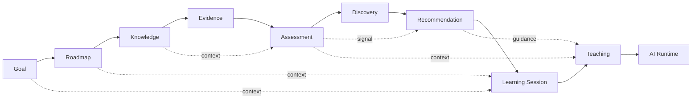

# Dependency Graph — Phase 2 Implementation Chain

## Scope

This document defines implementation order and dependency chain for:

- Goal
- Roadmap
- Knowledge
- Evidence
- Assessment
- Discovery
- Recommendation
- Learning Session
- Teaching
- AI Runtime

It explicitly identifies:
- upstream dependencies
- downstream dependencies
- shared infrastructure dependencies

---

## 1. High-Level Implementation Order

Recommended execution order for domain/capability progression:

1. Goal
2. Roadmap
3. Knowledge
4. Evidence
5. Assessment
6. Discovery
7. Recommendation
8. Learning Session
9. Teaching
10. AI Runtime

> Ordering above follows the requested representation. Operationally, Learning Session also provides upstream runtime context to Recommendation evaluation in some flows; that bidirectional coupling is explicitly tracked in the dependency sections below and must be managed through approved contracts to avoid cycle implementation errors.

---

## 2. Shared Infrastructure Dependencies (applies across chain)

All listed domains/capabilities depend on these shared foundations:

- Persistence Infrastructure (database/repository access)
- Event Bus Infrastructure (event publish/subscribe and delivery semantics)
- Shared Kernel (common contracts, identifiers, event envelope semantics)
- Auth/Identity context resolution (for learner-scoped operations)
- Observability/trace infrastructure (for runtime and explainability alignment)

Additional targeted shared dependency:
- AI Provider Infrastructure is mandatory for AI Runtime and downstream AI-backed Teaching behavior.

---

## 3. Upstream/Downstream Dependency Mapping

## 3.1 Goal
- **Upstream dependencies**
  - Shared Kernel
  - Persistence Infrastructure
- **Downstream dependencies**
  - Roadmap
  - Learning Session (goal context)
  - Teaching (contextual objective alignment)

## 3.2 Roadmap
- **Upstream dependencies**
  - Goal
  - Persistence Infrastructure
- **Downstream dependencies**
  - Knowledge (roadmap-node knowledge mapping context)
  - Learning Session (progression context)
  - Teaching (delivery context)

## 3.3 Knowledge
- **Upstream dependencies**
  - Roadmap context
  - Persistence Infrastructure
  - Event Bus (for expansion/event handling)
- **Downstream dependencies**
  - Evidence (knowledge-linked evidence paths)
  - Assessment (knowledge mastery targets)
  - Teaching (knowledge-grounded content strategy)

## 3.4 Evidence
- **Upstream dependencies**
  - Knowledge context
  - Persistence Infrastructure
- **Downstream dependencies**
  - Assessment (primary signal producer)
  - Discovery (indirect signal input)
  - Recommendation (via assessed signals)
  - Learning Session/Mentor flow linkage

## 3.5 Assessment
- **Upstream dependencies**
  - Evidence
  - Knowledge context (mastery references)
  - Event Bus
  - Explainability internal dependency path
- **Downstream dependencies**
  - Discovery
  - Recommendation
  - Teaching (assessment-informed intervention)
  - Learning profile/projection paths (outside requested chain)

## 3.6 Discovery
- **Upstream dependencies**
  - Assessment outputs
  - Event Bus
  - Explainability internal dependency path
- **Downstream dependencies**
  - Recommendation
  - Teaching (signal enrichment context)

## 3.7 Recommendation
- **Upstream dependencies**
  - Assessment
  - Discovery
  - Event Bus
  - Goal/Roadmap state projections (for recommendation context)
- **Downstream dependencies**
  - Learning Session (actionable recommendations in session behavior)
  - Teaching (recommendation-guided intervention/content strategy)

## 3.8 Learning Session
- **Upstream dependencies**
  - Goal/Roadmap context
  - Recommendation signals
  - Persistence Infrastructure
  - Event Bus
- **Downstream dependencies**
  - Teaching (session-state driven delivery)
  - Evidence generation/capture linkage in mentor loop

## 3.9 Teaching
- **Upstream dependencies**
  - Learning Session
  - Recommendation
  - Assessment
  - Goal/Roadmap
  - Knowledge
- **Downstream dependencies**
  - AI Runtime
  - Mentor interaction and response loop (outside requested chain list)

## 3.10 AI Runtime
- **Upstream dependencies**
  - Teaching invocation boundary
  - AI Provider Infrastructure
  - Runtime security/observability contracts
- **Downstream dependencies**
  - Teaching response quality and adaptation behavior
  - Decision/explainability trace capture paths

---

## 4. Dependency Chain (Linearized with Cross-Links)

---

## 5. Dependency Risk Notes

1. **Assessment/Discovery/Recommendation chain is event-sensitive**; event reliability controls are mandatory.
2. **Recommendation→Learning Session dependency must remain acyclic in implementation order**; if runtime state feedback is needed, use read models/events rather than direct cyclic module dependency.
3. **Teaching is multi-source dependent** and is a dependency concentration node.
4. **AI Runtime is downstream but operationally high-risk** due to provider/security/reliability dependencies.

---

## 6. Recommended Dependency Governance Rules

1. No direct dependency bypassing repository ownership boundaries.
2. No Recommendation write ownership inversion into upstream modules.
3. Event contract changes must be versioned and backward-compatible through transition windows.
4. AI Runtime integration remains behind capability boundary (no direct domain leakage).
