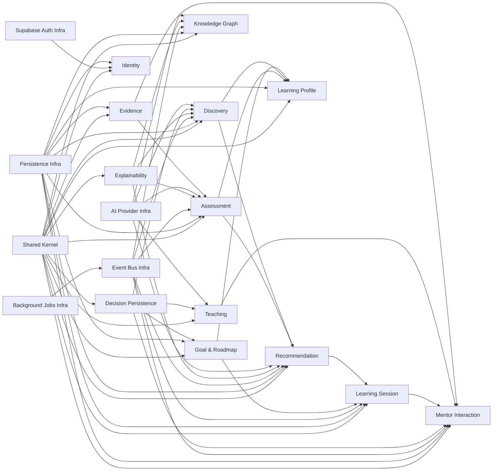

# MODULE_IMPLEMENTATION_ORDER.md

> Scope: implementation sequence planning only.  
> Frozen inputs only; no architecture changes.

---

## 1. Dependency graph (module level)

---

## 2. Implementation sequence (exact order)

### Wave 0 — Foundation
1. Shared Kernel
2. Persistence Infrastructure
3. Supabase Auth Integration Infrastructure
4. Event Bus Infrastructure
5. Background Jobs Infrastructure

### Wave 1 — First executable vertical slice
6. Identity Module
7. Goal & Roadmap Module
8. Learning Session Module

### Wave 2 — Knowledge and evidence capture
9. Knowledge Graph Module
10. Evidence Module

### Wave 3 — Core intelligence chain
11. Explainability Module (internal-only)
12. Assessment Module
13. Discovery Module
14. Recommendation Module

### Wave 4 — Presentation and decision routing
15. Teaching Module
16. Mentor Interaction Module
17. Decision Persistence Module (internal-only)
18. Learning Profile Module

### Wave 5 — AI adapter hardening
19. AI Provider Infrastructure integration in modules that require runtime AI invocation

---

## 3. Critical path

**Critical path for MVP functional loop:**

Shared Kernel  
→ Persistence/Auth/Event infra  
→ Identity  
→ Goal & Roadmap  
→ Learning Session  
→ Evidence  
→ Explainability  
→ Assessment  
→ Recommendation  
→ Teaching  
→ Mentor Interaction

If any node above is delayed, end-to-end mentor loop is delayed.

---

## 4. Module-by-module prerequisites/blockers/earliest point

| Module | Prerequisites | Blockers | Earliest implementation point |
|---|---|---|---|
| Shared Kernel | None | None | Day 1 |
| Persistence Infra | Shared Kernel contracts | DB connection/env not prepared | Day 1 |
| Supabase Auth Infra | Shared Kernel | JWT verification config missing | Day 1 |
| Event Bus Infra | Shared Kernel | Broker/runtime decision not wired | Day 1-2 |
| Background Jobs Infra | Event Bus Infra | Retry/dead-letter config missing | Day 2 |
| Identity | Auth Infra + Persistence | Batch 7 validation for prod confidence | Day 2 |
| Goal & Roadmap | Persistence + Shared Kernel | None for coding; Batch 6 for strict deployment posture | Day 3 |
| Learning Session | Goal & Roadmap + Persistence + Event Bus | Recommendation integration later | Day 4 |
| Knowledge Graph | Goal/Roadmap events + Persistence + Event Bus | Expansion behavior testing data availability | Day 5 |
| Evidence | Persistence + Shared Kernel | None | Day 5 |
| Explainability | Persistence + Shared Kernel | Trace-link policy deployment (Batch 6) for secure prod run | Day 6 |
| Assessment | Evidence + Explainability + Persistence + Event Bus | Explainability internal call contract not finalized in code | Day 6-7 |
| Discovery | Assessment read + Explainability + Persistence | Self-assessment input API contract readiness | Day 7 |
| Recommendation | Assessment + Discovery + Learning Session signals + Explainability | Event choreography tests pending | Day 8 |
| Teaching | Recommendation + Assessment + Goal/Roadmap + Knowledge + AI port | Real AI adapter optional for stub mode | Day 9 |
| Mentor Interaction | Learning Session + Teaching + Evidence | UI/API orchestration sequencing | Day 10 |
| Decision Persistence | Supporting internal boundaries + Persistence | Mechanism persistence nuances; still can scaffold interface now | Day 10 |
| Learning Profile | Assessment + Discovery + Goal/Roadmap read model | Projection query optimization | Day 11 |
| AI Provider Infra (runtime integration) | AI port consumers present | Provider credentials/network/security constraints | Day 12+ |

---

## 5. Practical dependency order by capability outcome

1. **Access and identity base:** SharedKernel + Auth + Persistence.
2. **Session governance:** Goal/Roadmap then Learning Session.
3. **Signal generation:** Evidence, Knowledge Graph.
4. **Signal evaluation:** Assessment, Discovery.
5. **Action synthesis:** Recommendation.
6. **Action delivery:** Teaching + Mentor Interaction.
7. **Cross-cutting traceability:** Explainability + Decision Persistence (internal surfaces).
8. **Read projection:** Learning Profile.

---

## 6. Suggested milestone checkpoints

- **M1:** Foundation modules compiled and smoke tested.
- **M2:** Identity + Goal + Learning Session command/query path working.
- **M3:** Evidence → Assessment event chain working with trace write call.
- **M4:** Recommendation proposal appears from regression/mismatch signals.
- **M5:** Teaching selection + Mentor session response loop functional.
- **M6:** Learning profile projection endpoint operational.

---

## 7. BACKEND_IMPLEMENTATION_READINESS_ASSESSMENT

| Dimension | Score | Status | Rationale |
|---|---:|---|---|
| Architecture Readiness | 92/100 | High | Dependencies and module boundaries are frozen. |
| Database Readiness | 78/100 | Medium-High | Batch 6/7 still required for full production confidence. |
| API Readiness | 84/100 | High | Command/query contracts stable enough to implement routing. |
| Module Readiness | 86/100 | High | Clear prerequisites/blockers per module. |
| AI Integration Readiness | 60/100 | Medium | Port is clear, provider execution details still operationally gated. |
| MVP Readiness | 81/100 | Medium-High | Critical path is now explicit and executable. |

**Verdict:** implementation can start immediately in dependency order while waiting for Batch 6/7 completion gates for production hardening.
