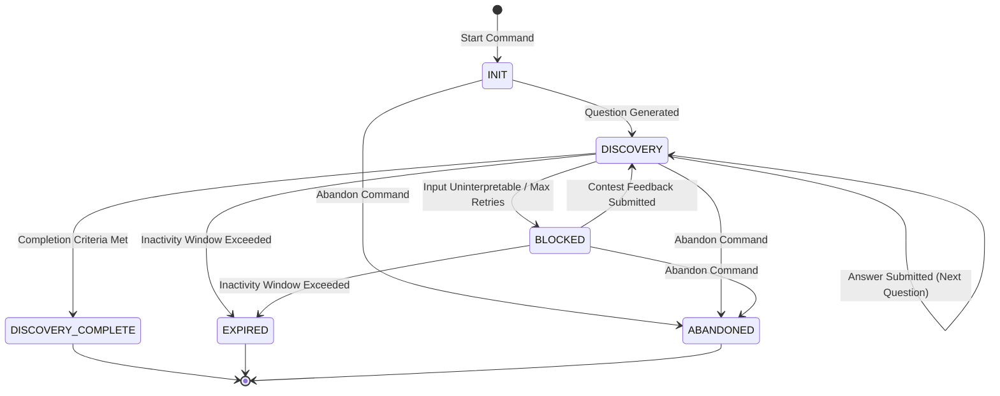

# Discovery Backend Specification

- **Phase:** Phase 1 — Discovery Engine (Backend Design)
- **Status:** Approved Architecture Draft
- **Authority:** This document defines the backend command/query boundaries, service layers, repositories, state-machine transitions, and error behaviors for the Discovery Engine, compliant with decisions DECISION-051 to DECISION-055.

---

## 1. Discovery Command Model (Write Operations)

### 1.1 `StartDiscoverySessionCommand`
* **Input DTO:**
  ```json
  {
    "learner_id": "UUID (Required)",
    "trigger": "String ('onboarding' | 'continuous') (Required)",
    "goal_id": "UUID (Optional)"
  }
  ```
* **Validation Rules:**
  - `learner_id` must be a valid UUID v4 format.
  - `trigger` must be exactly `"onboarding"` or `"continuous"`.
  - If `trigger` is `"continuous"`, `goal_id` must be a valid UUID v4 and cannot be null. If `trigger` is `"onboarding"`, `goal_id` should be null.
* **State Preconditions:** None (can be triggered at any time).
* **Side Effects:**
  - **Concurrency Check (DECISION-054):** Queries for any existing `discovery_session` for the same `learner_id` and `goal_id` that is in a non-terminal state (`INIT`, `DISCOVERY`, `BLOCKED`). If found, updates the old session setting `archived_at = CURRENT_TIMESTAMP` and `superseded_by_discovery_session_id = <new_session_id>`.
  - Inserts a new `discovery_session` record in `INIT` state.
  - Invokes `DiscoveryQuestionService` to generate the first question based on the trigger. Inserts a `discovery_question` record.
  - Transitions the new session state to `DISCOVERY`.
* **Events Produced:**
  - `DiscoverySessionStarted { discovery_session_id, learner_id, goal_id, trigger }`
  - `DiscoveryQuestionAsked { discovery_session_id, discovery_question_id, prompt_text }`

### 1.2 `SubmitDiscoveryAnswerCommand`
* **Input DTO:**
  ```json
  {
    "discovery_session_id": "UUID (Required)",
    "discovery_question_id": "UUID (Required)",
    "raw_input": "String (Required)"
  }
  ```
* **Validation Rules:**
  - Both IDs must be valid UUID v4 format.
  - `raw_input` must be non-empty, trimmed, and cannot exceed 2000 characters.
* **State Preconditions:**
  - The target `discovery_session` must exist and be in the `DISCOVERY` state.
  - The `discovery_question_id` must exist, belong to this session, and must NOT have any associated `discovery_answer` yet (validated via `UQ_discovery_answer_question_id`).
* **Side Effects:**
  - Inserts a `discovery_answer` record.
  - Triggers `DiscoveryAssessmentService` to process the answer:
    - Generates $\ge 1$ `competency_signal` records mapping to a `claimed_skill_area`.
    - Updates/Inserts the `claimed_skill_area_knowledge_node` relationships asynchronously.
  - Triggers `SelfAssessmentMismatchService` to evaluate mismatches:
    - Compares `self_reported_level` and `observed_level` (DECISION-051).
    - If gap $\ge 2$ levels, inserts `self_assessment_mismatch` immediately.
    - If gap = 1 level, schedules a verification probe question.
  - Evaluates Completion Criteria:
    - If all claimed skill areas have stable signals and confidence exceeds criteria: updates session state to `DISCOVERY_COMPLETE` and sets `completed_at = CURRENT_TIMESTAMP`.
    - If the input was uninterpretable or retry limits are exceeded: updates session state to `BLOCKED`.
    - Otherwise, generates a new `discovery_question` and inserts it (session remains in `DISCOVERY`).
* **Events Produced:**
  - `DiscoveryAnswerSubmitted { discovery_session_id, discovery_answer_id, raw_input }`
  - `CompetencySignalsObserved { competency_signal_ids: UUID[] }`
  - `SelfAssessmentMismatchDetected { self_assessment_mismatch_id, competency_signal_id, reasoning }` (Optional)
  - `DiscoverySessionCompleted { discovery_session_id, completed_at }` (Optional)
  - `DiscoverySessionBlocked { discovery_session_id, reason }` (Optional)

### 1.3 `AbandonDiscoverySessionCommand`
* **Input DTO:**
  ```json
  {
    "discovery_session_id": "UUID (Required)"
  }
  ```
* **Validation Rules:**
  - `discovery_session_id` must be a valid UUID v4.
* **State Preconditions:**
  - The target `discovery_session` must exist and be in a active, non-terminal state (`INIT`, `DISCOVERY`, `BLOCKED`).
* **Side Effects:**
  - Updates the session state to `ABANDONED`.
  - Sets `completed_at = CURRENT_TIMESTAMP`.
* **Events Produced:**
  - `DiscoverySessionAbandoned { discovery_session_id, completed_at }`

### 1.4 `ContestMismatchCommand`
* **Input DTO:**
  ```json
  {
    "discovery_session_id": "UUID (Required)",
    "competency_signal_id": "UUID (Required)",
    "raw_feedback": "String (Required)"
  }
  ```
* **Validation Rules:**
  - Both IDs must be valid UUID v4.
  - `raw_feedback` must be non-empty, trimmed, and cannot exceed 1000 characters.
* **State Preconditions:**
  - The target `discovery_session` must exist and be in either `BLOCKED` or the summary confirmation phase.
  - The `competency_signal_id` must belong to the session and have a recorded `self_assessment_mismatch`.
* **Side Effects:**
  - Inserts a contest record or logs user raw feedback.
  - Transitions the session state back to `DISCOVERY`.
  - Invokes `DiscoveryQuestionService` to generate a dedicated follow-up verification question targeted at the contested skill area. Inserts the `discovery_question`.
* **Events Produced:**
  - `MismatchContested { discovery_session_id, competency_signal_id, raw_feedback }`
  - `DiscoveryQuestionAsked { discovery_session_id, discovery_question_id, prompt_text }`

---

## 2. Discovery Query Model (Read Operations)

### 2.1 `GetDiscoverySessionQuery`
* **Filters:** `discovery_session_id` (UUID, Required).
* **Sorting/Pagination:** Not applicable (returns a single object).
* **Output DTO (Layer 2 Session Output Envelope):**
  ```json
  {
    "discovery_session_id": "UUID",
    "learner_id": "UUID",
    "goal_id": "UUID (Nullable)",
    "state": "String",
    "started_at": "DateTimeOffset",
    "completed_at": "DateTimeOffset (Nullable)",
    "goal_snapshot": {
      "goal_id": "UUID",
      "title": "String"
    },
    "competency_profile": [
      {
        "claimed_skill_area_id": "UUID",
        "label": "String",
        "self_reported_level": "String",
        "observed_level": "String"
      }
    ],
    "mismatch_signals": [
      {
        "self_assessment_mismatch_id": "UUID",
        "claimed_skill_area_id": "UUID",
        "reasoning": "String"
      }
    ],
    "confidence": 0.85,
    "reasoning": "String",
    "traced_to": ["String (Entity references)"],
    "next_step": "String",
    "next_question": {
      "discovery_question_id": "UUID (Nullable)",
      "prompt_text": "String (Nullable)"
    }
  }
  ```

### 2.2 `ListLearnerDiscoverySessionsQuery`
* **Filters:**
  - `learner_id` (UUID, Required) - Extracted from auth.
  - `state` (String, Optional)
  - `goal_id` (UUID, Optional)
* **Sorting:** `started_at` (DESC | ASC, Defaults to DESC).
* **Pagination:**
  - `limit` (Integer, Default 20, Max 100).
  - `offset` (Integer, Default 0).
* **Output DTO:**
  ```json
  {
    "sessions": [
      {
        "discovery_session_id": "UUID",
        "goal_id": "UUID (Nullable)",
        "trigger": "String",
        "state": "String",
        "started_at": "DateTimeOffset",
        "completed_at": "DateTimeOffset (Nullable)",
        "archived_at": "DateTimeOffset (Nullable)"
      }
    ],
    "total_count": 12
  }
  ```

### 2.3 `GetActiveDiscoverySessionQuery`
* **Filters:**
  - `learner_id` (UUID, Required)
  - `goal_id` (UUID, Required)
* **Sorting/Pagination:** None.
* **Output DTO:** Single lightweight session representation (matching properties of `ListLearnerDiscoverySessionsQuery`) where state is in (`INIT`, `DISCOVERY`, `BLOCKED`) and `archived_at IS NULL`. Returns `null` if none exist.

---

## 3. API Endpoint Matrix

| Route | Method | Request DTO | Response DTO | Error Codes | State Requirements |
| :--- | :--- | :--- | :--- | :--- | :--- |
| `/api/discovery/start` | `POST` | `{ "trigger": "onboarding" \| "continuous", "goal_id"?: "UUID" }` | Layer 2 Session Envelope | `400`, `401`, `409` | None. |
| `/api/discovery/session/:id/answer` | `POST` | `{ "discovery_question_id": "UUID", "raw_input": "String" }` | Layer 2 Session Envelope | `400`, `401`, `404`, `409` | Session `state` must be `DISCOVERY`. |
| `/api/discovery/session/:id/abandon` | `POST` | `{}` | Layer 2 Session Envelope | `401`, `404`, `409` | Session `state` must be `INIT`, `DISCOVERY`, or `BLOCKED`. |
| `/api/discovery/session/:id/contest` | `POST` | `{ "competency_signal_id": "UUID", "raw_feedback": "String" }` | Layer 2 Session Envelope | `400`, `401`, `404`, `409` | Session `state` must be `BLOCKED` or Summary. |
| `/api/discovery/session/:id` | `GET` | None (Query Param: none) | Layer 2 Session Envelope | `401`, `404` | None. |

*Note: All write endpoints require the `Idempotency-Key` header.*

---

## 4. State Transition Matrix



| Source State | Allowed Next States | Trigger | Validation Rules / Actions |
| :--- | :--- | :--- | :--- |
| `INIT` | `DISCOVERY` | First question generated | Inserts `discovery_question`, transitions automatically. |
| `INIT` | `ABANDONED` | Manual call to `/abandon` | Sets `completed_at = now()`. |
| `DISCOVERY` | `DISCOVERY` | Answer submitted (re-ask) | Generates and asks next question. |
| `DISCOVERY` | `DISCOVERY_COMPLETE` | Answer submitted (done) | Validates all claimed areas mapped/assessed; updates confidence. |
| `DISCOVERY` | `BLOCKED` | Max query failures | Triggered if user input is uninterpretable $\ge 3$ times sequentially. |
| `DISCOVERY` | `EXPIRED` | Time window check | Automatically updated if session inactive for $> 24$ hours. |
| `DISCOVERY` | `ABANDONED` | Manual call to `/abandon` | Sets `completed_at = now()`. |
| `BLOCKED` | `DISCOVERY` | Mismatch contested | Accepts raw feedback, clears block, generates validation probe. |
| `BLOCKED` | `EXPIRED` | Time window check | Triggered if blocked session remains inactive for $> 24$ hours. |
| `BLOCKED` | `ABANDONED` | Manual call to `/abandon` | Sets `completed_at = now()`. |

---

## 5. Service Layer Design

### 5.1 `DiscoverySessionService`
* **Responsibilities:**
  - Manages `DiscoverySession` creation and state persistence.
  - Enforces the concurrency policy (archiving older sessions for the learner-goal pair).
  - Handles timeout transitions (marking sessions as `EXPIRED`).
  - Orchestrates API actions (`start`, `abandon`).

### 5.2 `DiscoveryQuestionService`
* **Responsibilities:**
  - Formulates the prompts sent to the Goal Clarification and Competency Probing capabilities.
  - Integrates the list of prior questions and answers into the prompt context to ensure context continuity.
  - Saves new `discovery_question` rows to the database.

### 5.3 `DiscoveryAssessmentService`
* **Responsibilities:**
  - Evaluates learner answers by invoking the assessment AI engines.
  - Extracts evaluated levels and maps them to `CompetencySignal` entities.
  - Computes session confidence values based on signal consistency.

### 5.4 `SelfAssessmentMismatchService`
* **Responsibilities:**
  - Executes self-reporting vs observed level comparison checks (DECISION-051).
  - Triggers and manages follow-up verification probes (mismatch contestation logic).
  - Writes `self_assessment_mismatch` flags to the database.

---

## 6. Repository Layer Design

### 6.1 Repository Contracts
* **`IDiscoverySessionRepository`**
  - `GetById(id: UUID): DiscoverySession`
  - `GetActiveSession(learnerId: UUID, goalId: UUID): DiscoverySession`
  - `Save(session: DiscoverySession): void`
* **`IClaimedSkillAreaRepository`**
  - `GetBySessionId(sessionId: UUID): ClaimedSkillArea[]`
  - `Save(area: ClaimedSkillArea): void`
  - `SaveJunction(claimedSkillAreaId: UUID, discoveryAnswerId: UUID): void`
* **`IDiscoveryQuestionRepository`**
  - `GetBySessionId(sessionId: UUID): DiscoveryQuestion[]`
  - `Save(question: DiscoveryQuestion): void`
* **`IDiscoveryAnswerRepository`**
  - `GetByQuestionId(questionId: UUID): DiscoveryAnswer`
  - `Save(answer: DiscoveryAnswer): void`
* **`ICompetencySignalRepository`**
  - `GetBySessionId(sessionId: UUID): CompetencySignal[]`
  - `Save(signal: CompetencySignal): void`
  - `SaveJunction(competencySignalId: UUID, discoveryAnswerId: UUID): void`
* **`ISelfAssessmentMismatchRepository`**
  - `GetBySessionId(sessionId: UUID): SelfAssessmentMismatch[]`
  - `Save(mismatch: SelfAssessmentMismatch): void`

### 6.2 Transaction Boundaries
* **Session Initialization Transaction:**
  - Must write: New `DiscoverySession` + First `DiscoveryQuestion` + (optional) Update Old Superseded Session.
  - Boundary: Database Transaction. If question generation fails, session creation rollback occurs.
* **Answer Processing Transaction:**
  - Must write: `DiscoveryAnswer` + `CompetencySignal[]` + `SelfAssessmentMismatch[]` + (optional) Next `DiscoveryQuestion` + Updates to `DiscoverySession` state.
  - Boundary: Database Transaction. Ensures answer is never persisted without saving its generated assessment signals (Explainability integrity).

### 6.3 Concurrency Behavior
- **Optimistic Locking:** Snapshot tables (such as `discovery_session`) utilize `updated_at` verification checks or a `version_number` column. If an update occurs concurrently, a `409 CONFLICT` error is raised.
- **Junction Unique Indexes:** Unique database keys (`uq_discovery_answer_question_id`) ensure that race conditions from double-clicks are resolved at the database constraint level.

---

## 7. Explainability Design

### 7.1 Production of `traced_to[]`
1. The AI assessment engine returns an explainability array containing source references:
   - For a `CompetencySignal`, the AI service specifies which answer ID it was based on (e.g. `discovery_answer:<id>`).
2. The service layer writes this linkage directly to the `competency_signal_source_answer` junction table.
3. When querying the session envelope (Layer 2), the repository joins the signals, answers, and mismatches.
4. The application layer compiles the union of these references, outputting them in the `traced_to` array.

### 7.2 Persistence of Reasoning
- AI-generated explanation strings are captured from the LLM response.
- Persistent storage: `self_assessment_mismatch.reasoning` (column type: `NVARCHAR(MAX)`).
- This text is returned directly to the client inside the mismatch array, maintaining complete auditability.

---

## 8. Error Contract Design

All API errors return a standard error envelope mapping to **Layer 4 (Error Contract)**:
```json
{
  "error_code": "String (Upper snake_case)",
  "message": "String (User-friendly message in Vietnamese/Learner language)",
  "capability": "String (Identifying service scope)",
  "retriable": false,
  "trace_id": "UUID (Request correlation ID)"
}
```

### 8.1 Error Classification Table

| Error Code | HTTP | Description | Retriable |
| :--- | :---: | :--- | :---: |
| `VALIDATION_FAILED` | `400` | Missing required parameters, malformed UUID format, or raw text input limits exceeded. | `true` |
| `SESSION_NOT_FOUND` | `404` | The requested discovery session ID does not exist in the database. | `false` |
| `SESSION_STATE_CONFLICT` | `409` | An action was attempted on a session that is in an invalid state (e.g., answering an `ABANDONED` session). | `false` |
| `EXPLAINABILITY_TRACE_MISSING` | `500` | An assessment signal was generated but trace references were missing (triggers complete database transaction rollback). | `false` |
| `IDEMPOTENT_REPLAY_FAILED` | `409` | Replayed request with matching `Idempotency-Key` but mismatched payload parameters. | `false` |
| `AI_SERVICE_TIMEOUT` | `504` | The external AI orchestrator failed to return a question/assessment within the 10-second timeout window. | `true` |

---

## 9. Discovery Backend Readiness Report

### 9.1 Technical Specification Assessment
We have verified the backend specification against the domain constraints and physical DDL:
- **Write/Read Operations:** Fully mapped to commands, queries, and repository contracts.
- **Idempotency & Concurrency:** Protected by UUID keys, unique question-answer constraints, and correlation keys.
- **Explainability:** Enforced via atomic transaction boundaries and database junctions.

### 9.2 Gateway Recommendation

**Classification:** ✅ **`READY_FOR_CODE_GENERATION`**

The backend interfaces, services, and mappings are fully specified. The engineering team can now safely proceed with generating the backend code, controller routers, and database repository implementations.
